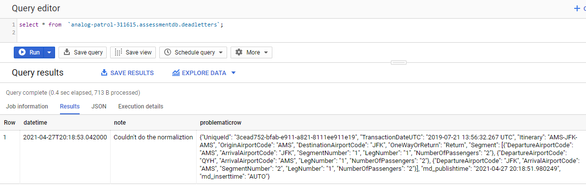
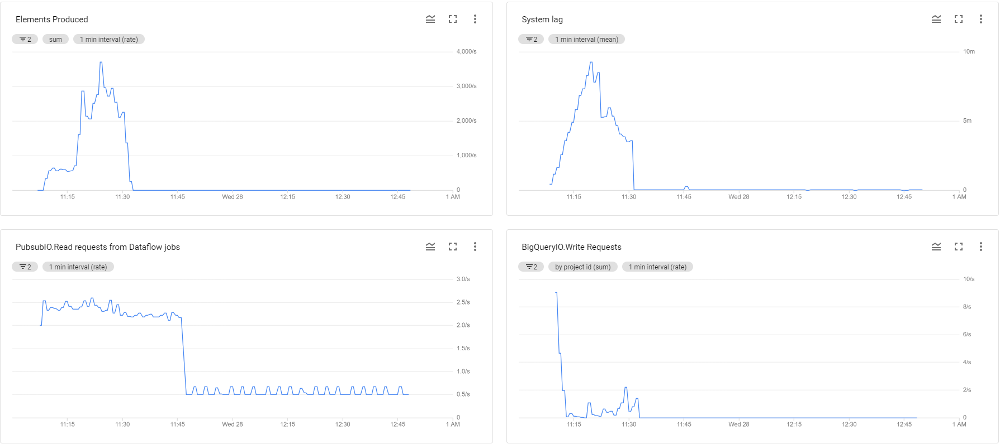
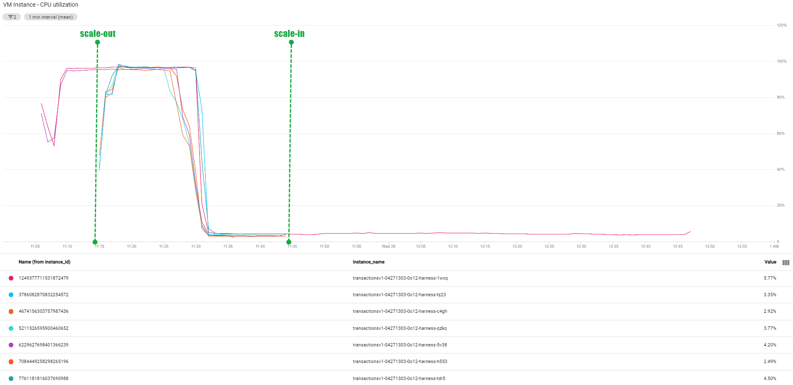

# Phase2 - Consumer

A small Python Apache Beam  pipeline to consume data from the Google Pub/Sub and loads it to Google BigQuery

## Key Points:
- Stores deadletters in BigQuery table
- Added two additional metadata columns which help in ETL latency calculation
    * publisher timestamp
    * db insert timestamp
- The pipeline normalize\flatten the received messages before load
- Can be hosted by Google DataFlow (DataflowRunner) or local (DirectRunner)

## Pipeline Diagram


## Installation

1. Configure gcloud and export GOOGLE_APPLICATION_CREDENTIALS
2. Create Phase2 cloud infrastructure via Cloud Deployment Manager
```ssh
gcloud deployment-manager deployments create publisherinfra --config phase2infra.yml
```
sample of output:
```ssh
motaz_r@cloudshell:~ (analog-patrol-311615)$ gcloud deployment-manager deployments create publisherinfra --config phase2infra.yml
The fingerprint of the deployment is b'zpOJYq2jwMGK8yIHPW8S9Q=='
Waiting for create [operation-1619728838732-5c1228210aaa8-e4a63bc6-a430482a]...done.
Create operation operation-1619728838732-5c1228210aaa8-e4a63bc6-a430482a completed successfully.
NAME               TYPE                            STATE      ERRORS  INTENT
assessment-bucket  storage.v1.bucket               COMPLETED  []
assessmentdb       gcp-types/bigquery-v2:datasets  COMPLETED  []
deadletters        gcp-types/bigquery-v2:tables    COMPLETED  []
locations          gcp-types/bigquery-v2:tables    COMPLETED  []
transactions       gcp-types/bigquery-v2:tables    COMPLETED  []
```
3. Install all required libraries

```sh
pip install -r requirements.txt
```

## Usage
I created two DataFlow pipelines:
1. Transaction Pipeline: subscribes to transaction topic and uses Dataflow auto-scaling
```ssh
python3 main.py \
--job_name transactionspipeline \
--project analog-patrol-311615 \
--input_topic "projects/analog-patrol-311615/topics/transaction" \
--bigquery_table "analog-patrol-311615:assessmentdb.transactions" \
--bigquery_deadletter_table "analog-patrol-311615:assessmentdb.deadletters" \
--streaming \
--runner DataflowRunner \
--region=us-east1 \
--temp_location=gs://assessment-bucket/temp \
--setup_file ./setup.py \
--num_workers 2 \
--autoscaling_algorithm THROUGHPUT_BASED \
--max_num_workers 7
```
2. Location Pipeline: subscribes to location topic
```ssh
python3 main.py \
--job_name locationspipeline \
--project analog-patrol-311615 \
--input_topic "projects/analog-patrol-311615/topics/location" \
--bigquery_table "analog-patrol-311615:assessmentdb.locations" \
--bigquery_deadletter_table "analog-patrol-311615:assessmentdb.deadletters" \
--streaming \
--runner DataflowRunner \
--region=us-east1 \
--temp_location=gs://assessment-bucket/temp \
--setup_file ./setup.py
```
## Dead Letter Handling
The messages that can't be processed (consumed) successfully will go to deadletter queue which will be stored in BigQuery. It is useful for debugging to determine why their processing doesn't succeed.

For the given data file (input_data.tar.gz), only one transaction is considered as DeadLetter by the normalization step because the nested Segment objects have different structure.


By checking the raw file, the second Segment object doesn't have SegmentNumber attribute 
```ssh
$ zgrep -a '3cead752-bfab-e911-a821-8111ee911e19' input_data.tar.gz|jq
{
  "UniqueId": "3cead752-bfab-e911-a821-8111ee911e19",
  "TransactionDateUTC": "2019-07-21 13:56:32.267 UTC",
  "Itinerary": "AMS-JFK-AMS",
  "OriginAirportCode": "AMS",
  "DestinationAirportCode": "JFK",
  "OneWayOrReturn": "Return",
  "Segment": [
    {
      "DepartureAirportCode": "AMS",
      "ArrivalAirportCode": "JFK",
      "SegmentNumber": "1",
      "LegNumber": "1",
      "NumberOfPassengers": "2"
    },
    {
      "DepartureAirportCode": "QYH",
      "ArrivalAirportCode": "AMS",
      "LegNumber": "1",
      "NumberOfPassengers": "2"
    },
    {
      "DepartureAirportCode": "JFK",
      "ArrivalAirportCode": "AMS",
      "SegmentNumber": "2",
      "LegNumber": "1",
      "NumberOfPassengers": "2"
    }
  ]
}

```

## Pipeline Metrics
Here are some metrics for the Transaction Pipeline




## BigQuery Tables


## Possible Improvements
- Can use an orchestration such as Google Cloud Composer/Airflow
- Add the publisher source as metadata (it may help if there are multiple publishers)
- pytest
