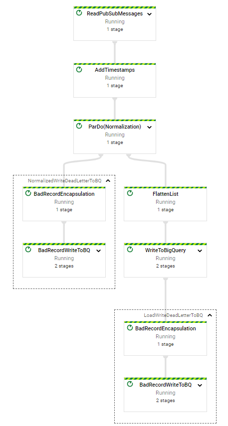

# Phase2 - Consumer

A small Python Apache Beam  pipeline to consume data from the Google Pub/Sub and loads it to Google BigQuery

## Key Points:
- Stores deadletters in BigQuery table
- Added two additional metadata columns which help in ETL latency calculation
    * publisher timestamp
    * db insert timestamp
- The pipeline normalize\flatten the received messages before load
- Can be hosted by Google DataFlow (DataflowRunner) or local (DirectRunner)

## Pipeline Diagram:



## Installation

1. Configure gcloud and export GOOGLE_APPLICATION_CREDENTIALS
2. Create Phase2 cloud infrastructure via Cloud Deployment Manager
```
motaz_r@cloudshell:~ (analog-patrol-311615)$ gcloud deployment-manager deployments create publisherinfra --config phase2infra.yml
The fingerprint of the deployment is b'zpOJYq2jwMGK8yIHPW8S9Q=='
Waiting for create [operation-1619728838732-5c1228210aaa8-e4a63bc6-a430482a]...done.
Create operation operation-1619728838732-5c1228210aaa8-e4a63bc6-a430482a completed successfully.
NAME               TYPE                            STATE      ERRORS  INTENT
assessment-bucket  storage.v1.bucket               COMPLETED  []
assessmentdb       gcp-types/bigquery-v2:datasets  COMPLETED  []
deadletters        gcp-types/bigquery-v2:tables    COMPLETED  []
locations          gcp-types/bigquery-v2:tables    COMPLETED  []
transactions       gcp-types/bigquery-v2:tables    COMPLETED  []
```
3. Install all required libraries

```sh
pip install -r requirements.txt
```

## Usage
I created two DataFlow pipelines:
1. transaction
```
python3 main.py \
--job_name transactionspipeline \
--project analog-patrol-311615 \
--project_id analog-patrol-311615 \
--input_topic "projects/analog-patrol-311615/topics/transaction" \
--bigquery_table "analog-patrol-311615:assessmentdb.transactions" \
--bigquery_deadletter_table "analog-patrol-311615:assessmentdb.deadletters" \
--streaming \
--runner DataflowRunner \
--region=us-east1 \
--temp_location=gs://assessment-bucket/temp \
--setup_file ./setup.py \
--num_workers 2 \
--autoscaling_algorithm THROUGHPUT_BASED \
--max_num_workers 7
```
2. location
```
python3 main.py \
--job_name locationspipeline \
--project analog-patrol-311615 \
--input_topic "projects/analog-patrol-311615/topics/location" \
--bigquery_table "analog-patrol-311615:assessmentdb.locations" \
--bigquery_deadletter_table "analog-patrol-311615:assessmentdb.deadletters" \
--streaming \
--runner DataflowRunner \
--region=us-east1 \
--temp_location=gs://assessment-bucket/temp \
--setup_file ./setup.py
```

## BigQuery Tables:

### transactions
partitioned table by Day on transactiondateutc
| ColumName | Type |
| ------ | ------ |
| transactiondateutc | TIMESTAMP |
| uniqueid | STRING |
| itinerary | STRING |
| originairportcode | STRING |
| destinationairportcode | STRING |
| onewayorreturn | STRING |
| segment_numberofpassengers | STRING |
| segment_segmentnumber | STRING |
| segment_legnumber | STRING |
| segment_departureairportcode | STRING |
| segment_arrivalairportcode | STRING |
| md_publishtime | TIMESTAMP |
| md_inserttime | TIMESTAMP |

### locations
non partitioned table
| ColumName | Type |
| ------ | ------ |
|airportcode | STRING |
|countryname | STRING |
|region | STRING |
|md_publishtime | TIMESTAMP |
|md_inserttime | TIMESTAMP |

### deadletters
partitioned table by Day on transactiondateutc
| ColumName | Type |
| ------ | ------ |
|datetime | TIMESTAMP |
|note | STRING |
|problematicrow | STRING|


## Possible Imporvments
- Can use an orchestration such as Google Cloud Composer/Airflow
- Add the publisher source (it may help if there are multiple publishers)
- pytest
