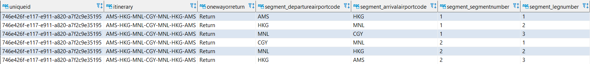
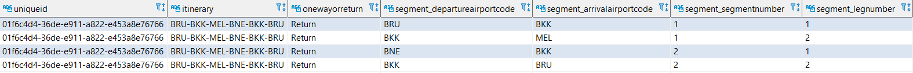
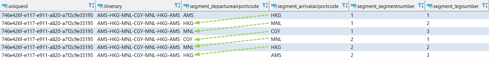
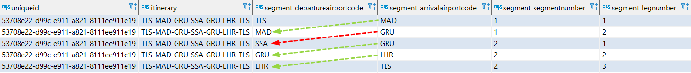
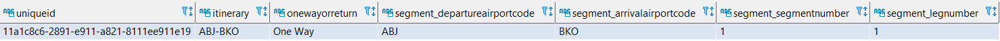
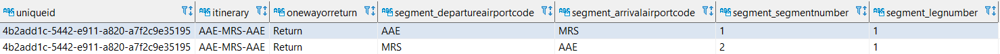
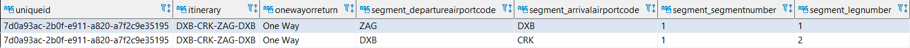
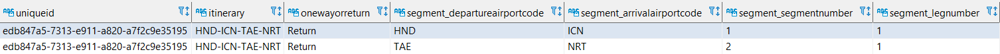

# Phase3 - Explore

Use SQL statements to gain explore data

## Consumed Data Validation
Compare the row count between raw files and BigQuery tables 
### Transactions Table
```ssh
$ zgrep -aio 'DepartureAirportCode' input_data.tar.gz | wc -l
261367
$ bq query --use_legacy_sql=false 'select count(*) from  `analog-patrol-311615.assessmentdb.transactions`'
Waiting on bqjob_r51a92e7d5e60af0e_000001792af91ef5_1 ... (0s) Current status: DONE
+--------+
|  f0_   |
+--------+
| 261364 |
+--------+
# there are 3 transactions in the deadletters table
$ bq query --use_legacy_sql=false 'select array_length(regexp_extract_all(problematicrow, "DepartureAirportCode")) from `analog-patrol-311615.assessmentdb.deadletters`'
Waiting on bqjob_r3a2eb3a0877fed3f_000001792b016657_1 ... (0s) Current status: DONE   
+-----+
| f0_ |
+-----+
|   3 |
```

### Locations Table
```ssh
$ bq query --use_legacy_sql=false 'select count(*) from  `analog-patrol-311615.assessmentdb.locations`'
Waiting on bqjob_r55166f655f6cc662_000001792af92e97_1 ... (0s) Current status: DONE
+------+
| f0_  |
+------+
| 1773 |
+------+
$ zgrep -aio 'CountryName' input_data.tar.gz | wc -l
1773

```

## Notebooks
* [Transactions_Location_Distribution.ipynb](notebooks/Transactions_Location_Distribution.ipynb)
* [Transactions_Datetime_Distribution.ipynb](notebooks/Transactions_Datetime_Distribution.ipynb)
* [ETL_Latency.ipynb](notebooks/ETL_Latency.ipynb)

## Suspicious Data

### 1. Transactions - Itinerary and Segments Review
There is some mismatch between the itinerary column and the segments columns
for the majority of the rows, for a given **transactions.uniqueid** sorting by **transactions.segment_segmentnumber** and **transactions.segment_legnumber** will give the same fights order as in **transactions.itinerary**

sql: [CompareItineraryWithSegmentsSuspiciousCases.sql](queries/CompareItineraryWithSegmentsSuspiciousCases.sql)
<br />
result: [CompareItineraryWithSegmentsSuspiciousCases.csv](results/CompareItineraryWithSegmentsSuspiciousCases.csv)

#### Correct Transaction Samples

e.g. 746e426f-e117-e911-a820-a7f2c9e35195

The itinerary is AMS-HKG-MNL-CGY-MNL-HKG-AMS based on Itinerary column and Segments columns


#### Suspicious Transaction Samples
e.g. 01f6c4d4-36de-e911-a822-e453a8e76766

the itinerary is BRU-BKK-MEL-BNE-BKK-BRU but based on Segments the itinerary is BRU-BKK-MEL-BKK-BRU


### 2. Transactions.Segments - arrivalairportcode and departureairportcode Review
There is some mismatch between the Segment.arrivalairportcode and the Segment.departureairportcode
for the majority of the rows, for a given **transactions.uniqueid** sorting by **transactions.segment_segmentnumber** and **transactions.segment_legnumber**, the **transactions.segment_arrivalairportcode** for the current row will be equal to **transactions.segment_arrivalairportcode** for the next row

sql: [CompareArrivalairportcodeWithDepartureairportcodeSuspiciousCases.sql](queries/CompareArrivalairportcodeWithDepartureairportcodeSuspiciousCases.sql)
<br />
result: [CompareArrivalairportcodeWithDepartureairportcodeSuspiciousCases.csv](results/CompareArrivalairportcodeWithDepartureairportcodeSuspiciousCases.csv)

#### Correct Transaction Samples

e.g. 746e426f-e117-e911-a820-a7f2c9e35195

The **transactions.segment_arrivalairportcode** for the current row is equal to **transactions.segment_arrivalairportcode** for the next row


#### Suspicious Transaction Samples

e.g. 53708e22-d99c-e911-a821-8111ee911e19

The **transactions.segment_arrivalairportcode** for the current row doesn't equal to **transactions.segment_arrivalairportcode** for the next row


### 3. Transactions - Itinerary and OneWayOrReturn Review
There is some mismatch between the Itinerary and the type of transaction (OneWay or Return)
for the majority of the rows, if the type of transaction is **OneWay** the transaction's source shouldn't be equal to the transaction's destination, on the other hand, when type of transaction is **Return** the transaction's source should be equal to the transaction's destination  

sql: [CompareItineraryWithOneWayOrReturnSuspiciousCases.sql](queries/CompareItineraryWithOneWayOrReturnSuspiciousCases.sql)
<br />
result: [CompareItineraryWithOneWayOrReturnSuspiciousCases.csv](results/CompareItineraryWithOneWayOrReturnSuspiciousCases.csv)

#### Correct Transaction Samples

e.g. 11a1c8c6-2891-e911-a821-8111ee911e19

Since this transaction is **OneWay**, The first element of **transactions.itinerary** doesn't equal to last element of **transactions.itinerary** 


e.g. 4b2add1c-5442-e911-a820-a7f2c9e35195

Since this transaction is **Return**, The first element of **transactions.itinerary** equals to last element of **transactions.itinerary** 


#### Suspicious Transaction Samples

e.g. 7d0a93ac-2b0f-e911-a820-a7f2c9e35195

This transaction is **OneWay** but the first element of **transactions.itinerary** equals to last element of **transactions.itinerary** 


e.g. edb847a5-7313-e911-a820-a7f2c9e35195

This transaction is **Return** but the first element of **transactions.itinerary** doesn't equal to last element of **transactions.itinerary** 


