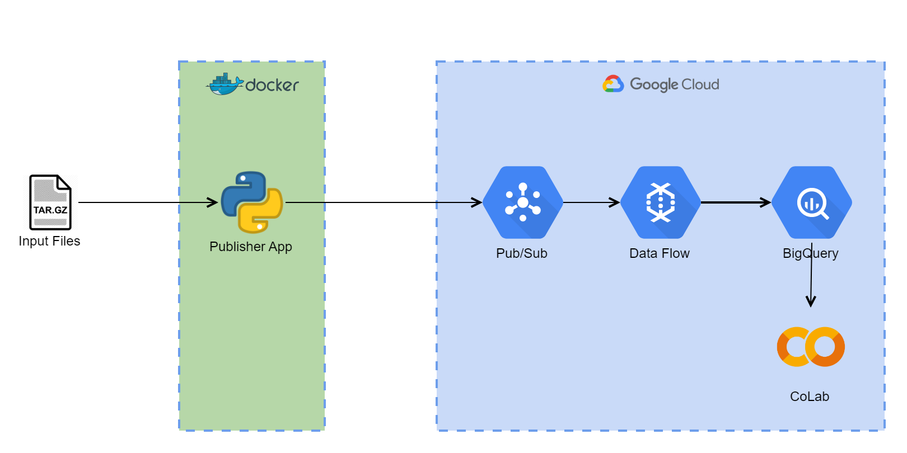

# de-assessments

Cloud-based data streaming POC.

## Tools/Technologies:
- Google Pub/Sub
- Google DataFlow/Apache Beam
- Google BigQuery
- Google Colab
- Cloud Deployment Manager
- Docker
- Protocol Buffers
- Python

## Architecture Diagram

